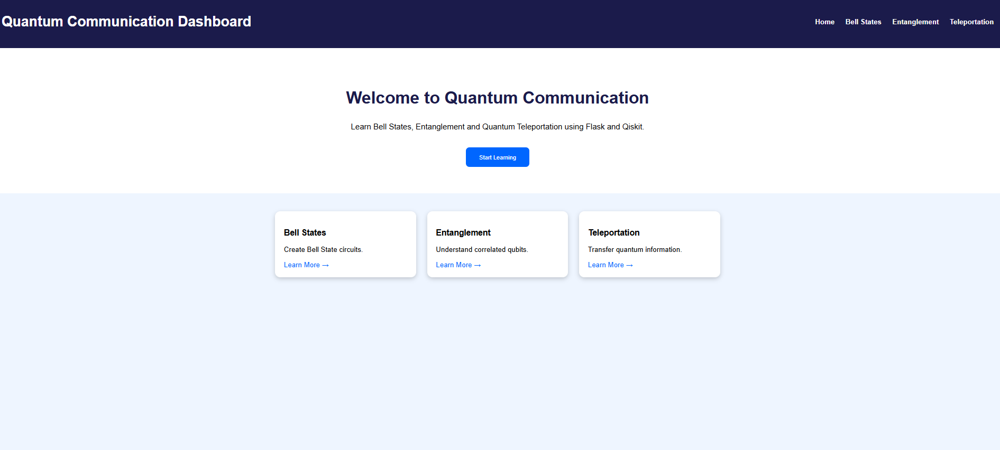
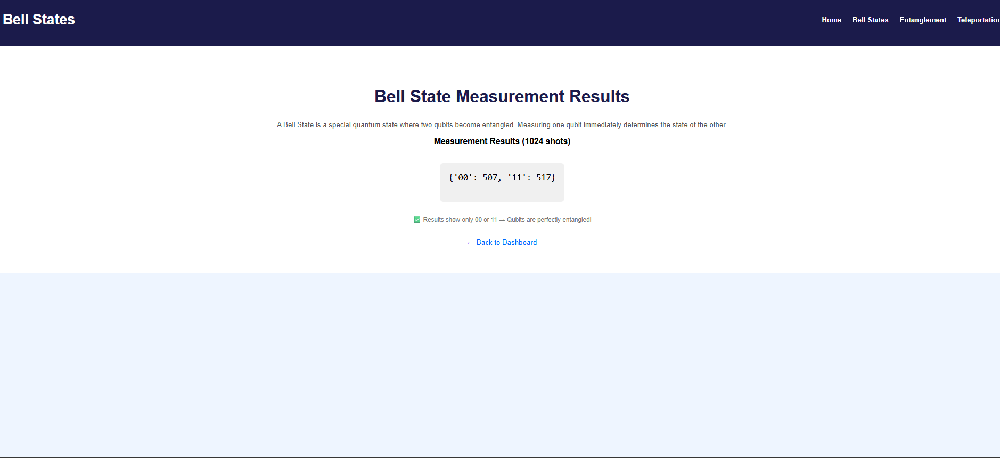
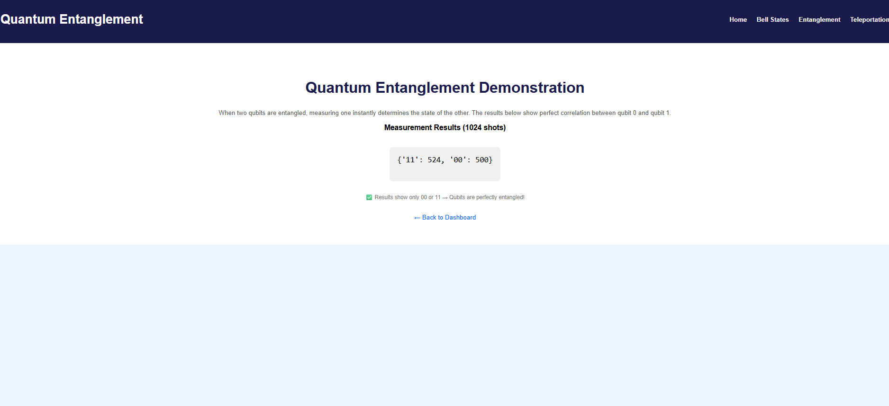
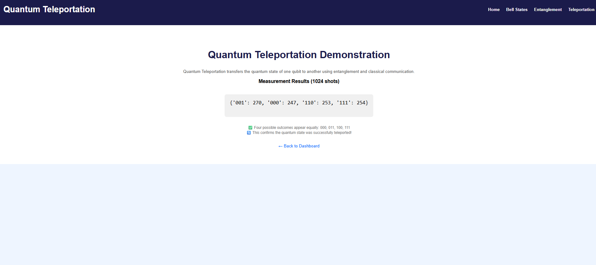

# 🚀 Quantum Communication Dashboard

A web-based dashboard for simulating quantum communication using Flask, Qiskit, and Python.

---

## 📖 Overview

This project demonstrates three quantum communication concepts:

- **Bell States** – Basic quantum entanglement
- **Quantum Entanglement** – Qubit correlations
- **Quantum Teleportation** – Transferring quantum states

---

## ✨ Features

- Interactive web dashboard
- Bell States simulation
- Quantum Entanglement demonstration
- Quantum Teleportation simulation
- Measurement results display
- Responsive design

---

## 🛠️ Technologies

- Python 3.x
- Flask
- Qiskit
- Qiskit Aer
- HTML5
- CSS3
- JavaScript

---

## 📁 Project Structure

```text
Quantum-Communication-Dashboard/
├── app.py
├── requirements.txt
├── README.md
├── templates/
│   ├── index.html
│   ├── bell.html
│   ├── entanglement.html
│   └── teleportation.html
├── static/
│   ├── style.css
│   └── script.js
├── quantum/
│   ├── __init__.py
│   ├── bell_states.py
│   ├── entanglement.py
│   └── teleportation.py
├── outputs/
└── images/
    ├── home.png
    ├── bell.png
    ├── entanglement.png
    └── teleportation.png
```

---

## 🚀 Installation

### 1. Clone the repository

```bash
git clone https://github.com/yourusername/Quantum-Communication-Dashboard.git
cd Quantum-Communication-Dashboard
```

### 2. Create a virtual environment

```bash
python -m venv venv
```

### 3. Activate the virtual environment

**Windows**

```bash
venv\Scripts\activate
```

**macOS / Linux**

```bash
source venv/bin/activate
```

### 4. Install dependencies

```bash
pip install -r requirements.txt
```

---

## 💻 Usage

### Run the application

```bash
python app.py
```

### Open in your browser

```text
http://127.0.0.1:5000
```

---

## 📸 Screenshots

### Home Page



### Bell States



### Quantum Entanglement



### Quantum Teleportation



---

## 📊 Expected Results

| Page | URL | Example Output |
|------|-----|----------------|
| Bell States | `/bell` | `{'00': 512, '11': 512}` |
| Quantum Entanglement | `/entanglement` | `{'00': 512, '11': 512}` |
| Quantum Teleportation | `/teleportation` | `{'000': 258, '011': 255, '100': 257, '111': 254}` |

---

## 🧠 What I Learned

- Building web applications with Flask
- Creating responsive web interfaces
- Developing quantum circuits using Qiskit
- Understanding Bell States
- Understanding Quantum Entanglement
- Implementing Quantum Teleportation
- Organizing a Python project
- Working with virtual environments

---


## 🙏 Acknowledgments

- IBM Qiskit – Quantum Computing Framework
- Flask – Python Web Framework

---


